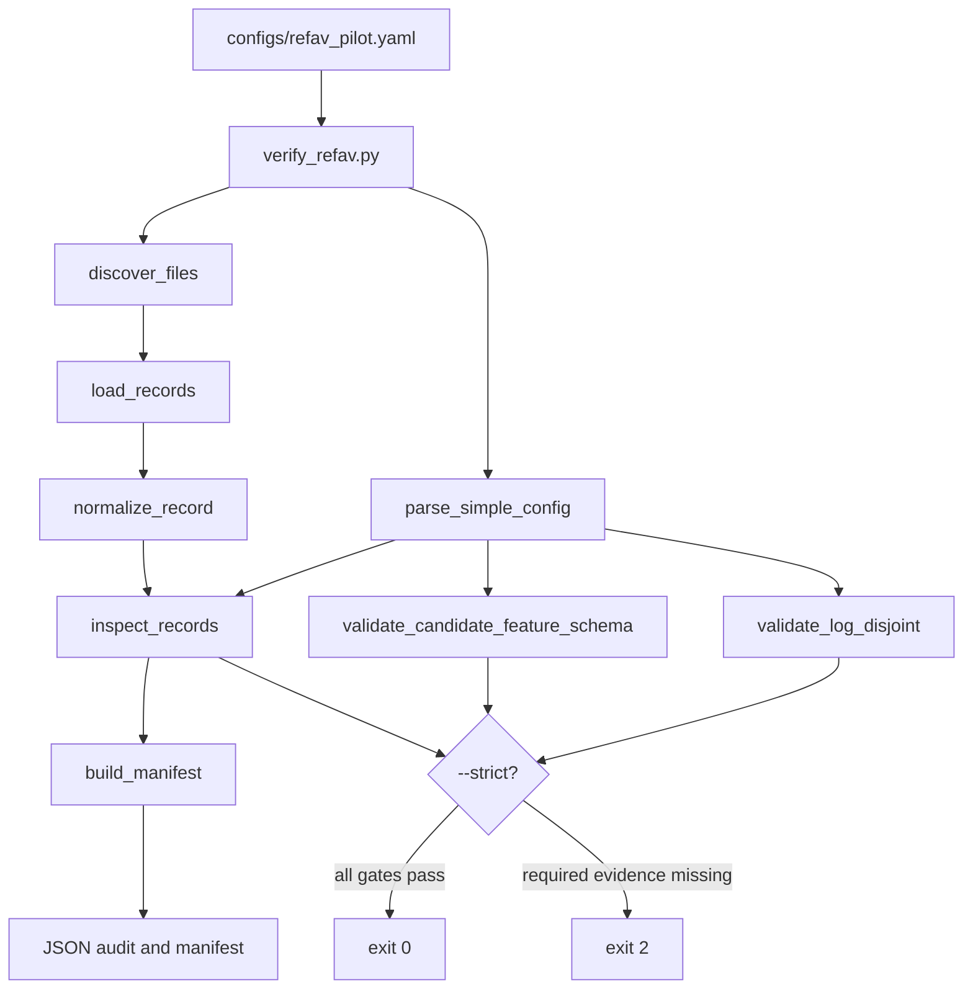

# Architecture and Data Flow

## Main verifier flow



## Step-by-step execution

When you run:

```bash
python scripts/verify_refav.py \
  --config configs/refav_pilot.yaml \
  --records /path/to/tracks.pkl \
  --output manifests/refav_audit.json \
  --strict
```

the following happens:

1. Python starts the script and adds the repository `src/` directory to `sys.path`, so the local `driveone` package can be imported without installing the package.
2. The small YAML-like config parser reads the protocol values. It is intentionally dependency-light and is not a general YAML parser.
3. The file-discovery function resolves the explicit record path or scans the configured data root for supported suffixes.
4. The loader chooses a format adapter: JSON, JSONL, CSV, Feather, or trusted local pickle.
5. Every record is normalized. Aliases such as `track_uuid`, `mining_category`, `timestamp`, and `confidence` are mapped to the canonical names while original fields remain available.
6. The inspector groups records by `(log_id, prompt, timestamp_ns)` because that is the fixed-frame candidate decision unit.
7. It counts labels, missing fields, camera associations, candidate groups, duplicate candidates, nonfinite values, timestamp-order violations, potential leakage fields, logs, prompts, and normalized prompt templates.
8. The split manifest is checked for log overlap.
9. The manifest builder hashes every inspected file and stores the configuration and inspection result.
10. JSON is printed and optionally written to disk.
11. Strict mode returns exit code `2` when required evidence is missing. It does not try to repair a bad dataset.

## Candidate record versus audit record

The same row can contain fields needed to audit labels and fields allowed as model input. The verifier deliberately keeps these concepts separate. For example, `label` is required to measure a result but forbidden as a learned candidate feature. A future model adapter must construct an explicit feature object rather than passing the entire normalized row into a neural network.

## Why there is no model yet

The data contract is upstream of the model. If the candidate pool already identifies the referred object, if candidate geometry is unavailable in the image, or if train and test logs overlap, a high Recall@1 would not establish the proposed mechanism. The architecture therefore stops at the cheapest falsification point.

## PE smoke-test flow

```mermaid
flowchart LR
    A[smoke_test_pe.py] --> B[import torch/Pillow/official PE]
    B --> C[VisionTransformer.from_config]
    C --> D[image preprocessing]
    D --> E[forward_features strip_cls_token=false]
    D --> F[forward_features strip_cls_token=true]
    D --> G[model(image) pooled output]
    E --> H[shape/dtype/device/latency JSON]
    F --> H
    G --> H
```

The current smoke test is an interface check, not a training run. It does not establish that the PE output is useful for the task or that the text tokenizer and proposed question-conditioned fusion interface are correct.
