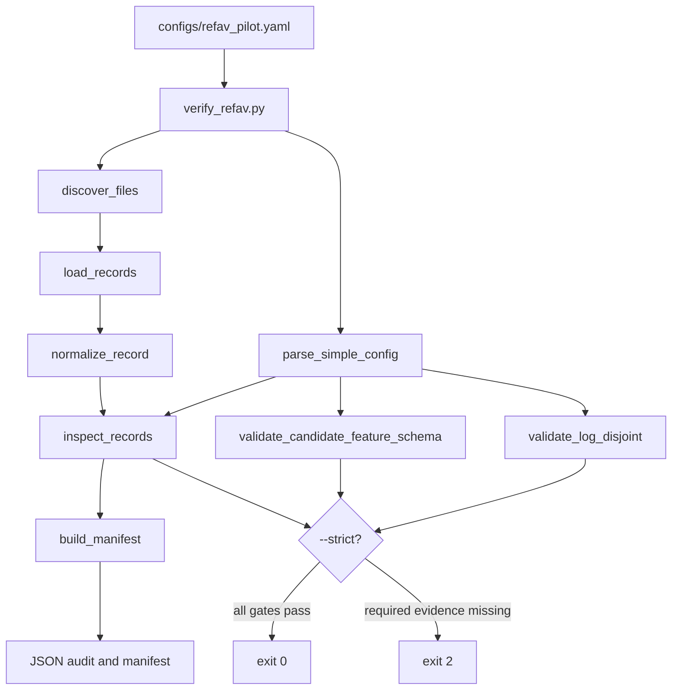

# Architecture and Data Flow

## Main verifier flow

Think of the repository as two short pipelines. The first builds a candidate table. The second checks that table. The PE smoke test is separate because it needs a large external model environment.



## Step-by-step execution

When you run:

```bash
python scripts/verify_refav.py \
  --config configs/refav_pilot.yaml \
  --records /path/to/tracks.pkl \
  --output manifests/refav_audit.json \
  --strict
```

the following happens:

1. Python adds `src/` to the import path so the local package can be used from a checkout.
2. The small config parser reads the protocol. It supports only the simple YAML-like subset used here.
3. The verifier finds the explicit record file, or scans the configured data directory.
4. The loader reads JSON, JSONL, CSV, Feather, or trusted local pickle.
5. The normalizer maps source names such as `track_uuid` and `mining_category` to the common names, while preserving the original fields.
6. The inspector groups rows by `(log_id, prompt, timestamp_ns)`. That tuple is one ranking decision.
7. It counts missing fields, labels, camera links, duplicates, bad numbers, timestamp problems, possible leakage fields, logs, prompts, and rough prompt templates.
8. The split checker looks for the same log in two splits.
9. The manifest builder hashes the files and stores the settings and audit result.
10. The script prints JSON and can save it.
11. In strict mode, exit code `2` means a required check failed. The script reports the problem; it does not repair the data.

## Candidate record versus audit record

The same row can contain fields needed to audit labels and fields allowed as model input. The verifier deliberately keeps these concepts separate. For example, `label` is required to measure a result but forbidden as a learned candidate feature. A future model adapter must construct an explicit feature object rather than passing the entire normalized row into a neural network.

## Why there is no model yet

The data contract comes before the model. If the candidate pool already identifies the referred object, if candidate geometry is unavailable in the image, or if train and test logs overlap, a high Recall@1 would not establish the proposed mechanism. We therefore stop at the cheapest useful failure point.

## PE smoke-test flow

```mermaid
flowchart LR
    A[smoke_test_pe.py] --> B[import torch/Pillow/official PE]
    B --> C[VisionTransformer.from_config]
    C --> D[image preprocessing]
    D --> E[forward_features strip_cls_token=false]
    D --> F[forward_features strip_cls_token=true]
    D --> G[model(image) pooled output]
    E --> H[shape/dtype/device/latency JSON]
    F --> H
    G --> H
```

The current smoke test is an interface check, not a training run. It loads the PE vision tower and records patch and pooled shapes. It does not run the official CLIP text path, prove that patch tokens are useful, or measure the proposed fusion block.
